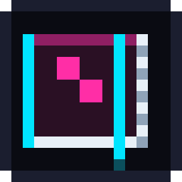
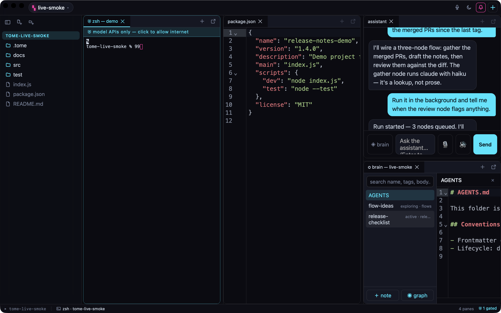

#  Tome

**Run your coding agents in a containment cell, in one workspace.** Agents,
terminals, editors, documents, and an AI assistant share one grid — light or
dark, following your system by default.

[](https://github.com/zwaneldmz/tome/actions/workflows/build.yml)
[](LICENSE)



New here? [Take the interactive tour.](https://zwaneldmz.github.io/tome/how-tome-works.html)

## What it is

Tome is a desktop app for working with AI coding agents. You open agents,
terminals, editors, and documents as panes in a tiling grid, and an assistant
sits alongside them. The point of difference: **agents run in an OS-level
sandbox with no network access by default**, so a tool you don't fully trust
can't quietly phone home.

## Quick start

You need **Bun** (1.3+) and a stable **Rust toolchain** (plus the Xcode Command
Line Tools on macOS). On Linux, also install **bubblewrap** — it's what the
sandbox is built on.

```bash
bun install     # installs the renderer deps
bun run dev     # launch the app (tauri dev)
```

Prebuilt bundles (macOS universal, Linux `.deb`/`.rpm`/`.AppImage`) are on the
[releases page](https://github.com/zwaneldmz/tome/releases) — unsigned for
now, with checksums and build provenance you can verify.

To use the assistant, set an API key for one provider (see [The assistant](#the-assistant)).
Everything else works without a key.

## The containment cell

An agent pane runs inside an OS sandbox that blocks all network access. The
only way out is a small local proxy that allows **model-provider domains and
nothing else**.

- A pane's **cyan strip** opens that pane's proxy for 15, 30, or 60 minutes,
  then it re-locks on its own. Opening it asks for your second factor (an
  authenticator code, or your passphrase). Blocked hosts show up on the strip.
- Opening a pane widens the **proxy**, never the sandbox — a contained pane
  still can't touch raw sockets, SSH, or your Tome config files.
- Need full, normal network access? Spawn an **uncontained pane** from the
  `＋` menu. Because that pane can run anything with your privileges, Tome asks
  for your passphrase or code first — every time.
- A repo can ship a **team allowlist** at `.tome/airgap.json`. Tome validates
  it and asks you to approve it before using it; editing it later re-asks.
- A **security event log** records unlocks, blocked hosts, and assistant
  actions (what happened, never the contents). Open it from the `＋` menu.

## The assistant

The chat pane talks to a model provider you pick in Preferences:

| Provider | Key to set | Notes |
|---|---|---|
| **Kimi** (Moonshot) | `MOONSHOT_API_KEY` | the default |
| **GLM** (Zhipu) | `ZHIPU_API_KEY` | |
| **Claude** (Anthropic) | `ANTHROPIC_API_KEY` | |
| **DeepSeek** (V4 Pro / Flash) | `DEEPSEEK_API_KEY` | pick Pro or Flash in Preferences |

Two shortcuts: set `REQUESTY_API_KEY` to route Claude Opus through the Requesty
router instead, or set `TOME_CHAT_BASE_URL` / `TOME_CHAT_MODEL` to point at any
OpenAI- or Anthropic-compatible endpoint. Your key stays in the main process
and never reaches the browser layer.

**Any provider:** Preferences → Assistant → *Custom provider* lets you point the
assistant at any OpenAI- or Anthropic-compatible endpoint (base URL + model +
key + wire). The key is stored locally in the 0600 store, never sent to a
browser or logged.

The assistant is also a **conductor** — it can list your panes, open panes and
files, and type into a terminal. Two guardrails:

- It only **runs** a command when you turn on *assistant may run commands* in
  the `＋` menu (off by default). With it off, nothing is submitted without your
  Enter.
- It can **read** a terminal's scrollback only for panes you approve — Tome
  asks before the first read, and contained panes are never readable.

**Voice is fully local.** The `🎙` button records push-to-talk audio and
transcribes it with a local whisper.cpp sidecar — audio never leaves your
machine, and the transcript lands in the composer for you to edit and send.
One-time setup: `brew install whisper-cpp`, then the first click shows the exact
command to fetch the model file.

## Features

- **Workspaces** — named groups of project folders. Switch, create, or add
  folders from the `▚` chip in the top bar.
- **Agent panes** — spawn Claude Code, opencode, or pi in a real terminal from
  the `＋` menu. Agents appear automatically when their CLI is on your `PATH`.
- **Pane grid** — drag panes to rearrange, drop one on another to stack them as
  tabs. Tear a pane off into its own window with `⧉` (or by dragging it past the
  window edge); your layout is saved.
- **Flows** — wire agents into a small graph in a `.flow.json` file: each node
  says what it needs and what it produces. **Run** executes the graph in the
  background, one headless agent per node, in dependency order — inside the
  same containment a normal pane would get. Starter graphs:
  [examples/flows/](examples/flows/).
- **Editor** — CodeMirror 6 with language auto-detect, `⌘S` to save, and a
  dirty indicator.
- **Documents** — PDFs, images, and converted `.docx` / `.xlsx` open in
  sandboxed viewers.
- **Git** — a branch chip to switch or create branches, live `+ ~ −` and `↑↓`
  counters, and an IntelliJ-style commit **History** pane.
- **App login** — set a passphrase and Tome locks at launch; unlock with Touch
  ID or your passphrase (plus an authenticator code if enrolled). The lock is
  enforced in the main process, not just painted on.
- **Appearance** — light, dark, or match the system, from the `◐` chip. `⌘B`
  hides the sidebar.

## Building a release

```bash
bun run package  # tauri build → src-tauri/target/release/bundle/  (unsigned)
```

Local packages are **unsigned by design**, so contributors don't need an Apple
Developer ID. After copying to `/Applications`, clear the quarantine flag for a
dev build:

```bash
xattr -dr com.apple.quarantine /Applications/Tome.app
```

Tagged releases (`vX.Y.Z`) build in `.github/workflows/release-tauri.yml` and
publish a macOS universal `.dmg` and Linux `.deb` / `.rpm` / `.AppImage` with
`SHA256SUMS` manifests and a build-provenance attestation. **Code signing and
notarization are on the roadmap** — until the Apple credentials are
configured, released builds are unsigned too. Verify a download before opening
it:

```bash
shasum -a 256 -c SHA256SUMS-macos-latest   # matches the manifest
```

Once signing lands, also:

```bash
codesign --verify --deep --strict Tome.app
spctl -a -vv Tome.app                      # Gatekeeper accepts it
xcrun stapler validate Tome.app            # notarization is stapled
```

## Security

In one sentence: agent CLIs run sandboxed with no direct network access, and
the only route out — a per-pane, provider-only proxy — opens only behind a
second factor, never the sandbox itself. The assistant's read-terminal and
run-command abilities are gated behind explicit, per-pane consent.

See [SECURITY.md](SECURITY.md) for the security summary and how to report a
vulnerability.

## Platform support

macOS and Linux. The sandbox uses macOS seatbelt (`sandbox-exec`) on macOS and
bubblewrap network namespaces on Linux; the allowlist proxy itself is
platform-neutral.

## Stack

Rust + Tauri v2 · Vite · dockview (pane grid) · xterm (terminals, PTYs owned
by the Rust backend) · CodeMirror 6 · mammoth + SheetJS (documents) · the
Anthropic SDK and OpenAI-compatible providers (assistant).

## License

[MIT](LICENSE)
