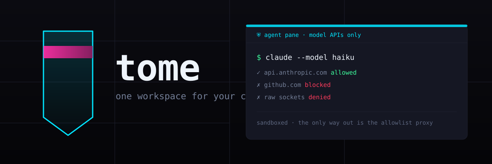
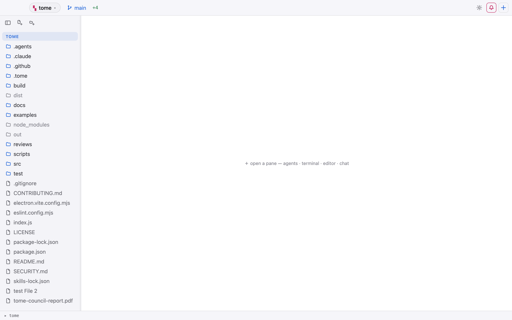
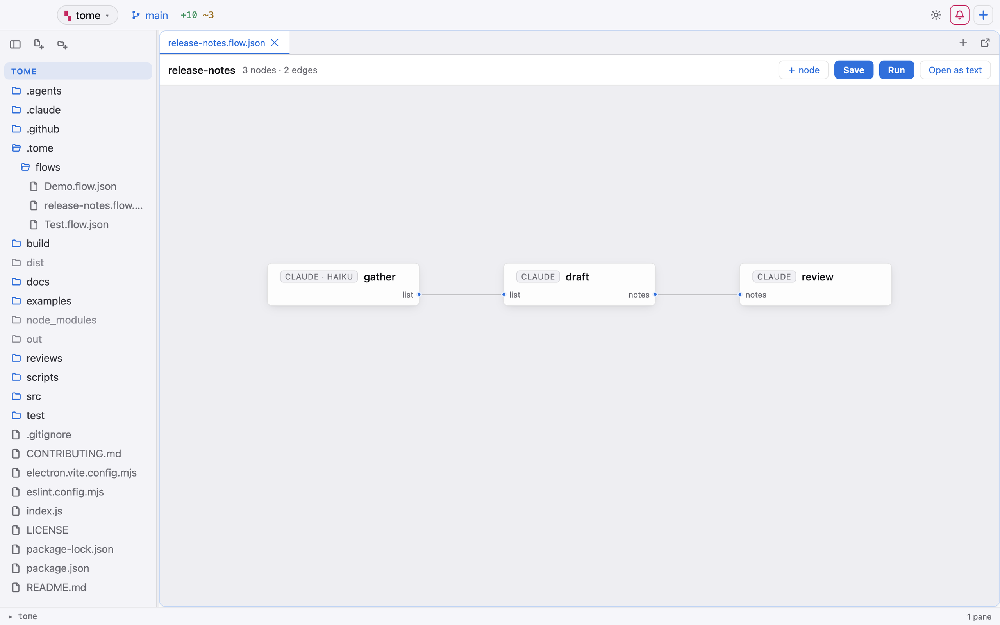
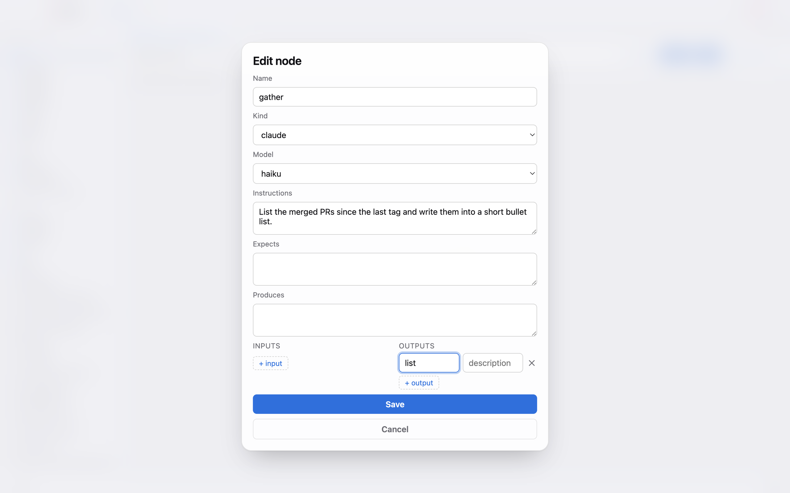

<div align="center">
  <a href="https://zwaneldmz.github.io/tome/">
    
  </a>

  **One workspace for your coding agents — with the agents in a containment cell.**
  Terminals, editors, documents, flows, and an AI assistant share one tiling
  grid, and every agent runs in an OS-level sandbox with no direct network
  access unless you open a door for it.

  <p>
    <a href="https://github.com/zwaneldmz/tome/actions/workflows/build.yml"></a>
    <a href="https://github.com/zwaneldmz/tome/releases"></a>
    <a href="LICENSE"></a>
  </p>
</div>


New here? **[Take the interactive tour](https://zwaneldmz.github.io/tome/how-tome-works.html)** — ten
clickable steps through a real session, with a screen recording of a flow
being built.

## Contents

- [Why Tome?](#why-tome)
- [Quick start](#quick-start)
- [What's in the grid](#whats-in-the-grid)
- [How the containment works](#how-the-containment-works)
- [Flows](#flows)
- [The assistant](#the-assistant)
- [Building a release](#building-a-release)
- [Security](#security)
- [Stack](#stack)
- [Roadmap](#roadmap)

## Why Tome?

AI coding agents are terrific — and they run with your shell, your
credentials, and your network. Tome exists for the moment you'd like to try
an agent (or an agent-written tool) *without* handing it all three. Its
answer:

- Agents run inside a real OS sandbox (macOS seatbelt, Linux bubblewrap) with
  **no direct network access** — raw sockets, SSH, and DNS are all denied.
- The only way out is a small local proxy that allows **model-provider
  domains and nothing else** — so the agent can think, but not phone home.
- Opening that door is deliberate: a click, a second factor, and an automatic
  re-lock on a timer.

Everything else — the pane grid, git tools, documents, notes, voice, flows —
is there so the cautious setup is also a pleasant place to spend the day.

## Quick start

You need **Bun** (1.3+) and a stable **Rust toolchain** (plus the Xcode
Command Line Tools on macOS). On Linux, also install **bubblewrap** — it's
what the sandbox is built on.

```bash
bun install     # installs the renderer deps
bun run dev     # launch the app (tauri dev)
```

Prefer a bundle? Prebuilt packages (macOS universal `.dmg`, Linux
`.deb`/`.rpm`/`.AppImage`) are on the
[releases page](https://github.com/zwaneldmz/tome/releases) — unsigned for
now, with checksums and build provenance you can verify.

To use the assistant, set an API key for one provider (see
[The assistant](#the-assistant)). Everything else works without a key.

## What's in the grid

You start with an empty grid and a `＋` button. Everything in Tome opens from
that menu into the same tiling grid: agents, terminals, editors, documents,
flows, notes.



| Pane | What it does |
|---|---|
| **Agents** | Claude Code, opencode, pi, and any custom CLI on your `PATH`, in a real PTY — sandboxed by default. |
| **Terminals** | xterm, PTYs owned by the Rust backend. |
| **Editor** | CodeMirror 6, language auto-detect, `⌘S` to save, LSP diagnostics. |
| **Documents** | PDFs, images, and converted `.docx`/`.xlsx` in sandboxed viewers. |
| **Flows** | Wire agents into a graph and run it headless in the background. |
| **Assistant** | A chat that can also drive the grid — read scrollback, open panes, type into terminals. |
| **Brain** | A per-workspace markdown note vault with `[[wikilinks]]`, backlinks, and a graph view. |
| **Git** | Branch chip, live `+ ~ −` / `↑↓` counters, and a commit **History** pane. |
| **Voice** | Push-to-talk, transcribed locally by whisper.cpp — audio never leaves the machine. |

Drag panes to rearrange, drop one on another to stack them as tabs, tear a
pane off into its own OS window with `⧉`. Your layout is saved and restored.

The `＋` menu lists every agent CLI found on your `PATH`, alongside plain
terminals and the app's own panes. The two toggles that matter live right
here: *spawn agents sandboxed* and *assistant may run commands*.

## How the containment works

An agent pane runs inside an OS sandbox that blocks all direct network
access. The only way out is a small local proxy that allows **model-provider
domains and nothing else**.

```
                     ┌─────────────────────────────────┐
                     │         OS sandbox              │
                     │  (seatbelt / bubblewrap)        │
                     │                                 │
  your repo  ──────▶ │  agent CLI   ──✗── raw sockets  │
                     │     │         ──✗── SSH / DNS   │
                     │     │                           │
                     │     └──────────▶ 127.0.0.1      │
                     └──────────────────┬──────────────┘
                                        │ CONNECT proxy (allowlist)
                                        ▼
                             model-provider domains only
                        (api.anthropic.com, api.openai.com, …)
```

- A pane's **cyan strip** opens that pane's proxy for 15, 30, or 60 minutes,
  then it re-locks on its own. Opening it asks for your second factor (an
  authenticator code, or your passphrase). Blocked hosts show up on the
  strip.
- Opening a pane widens the **proxy**, never the sandbox — a contained pane
  still can't touch raw sockets, SSH, or your Tome config files.
- Need full, normal network access? Spawn an **uncontained pane** from the
  `＋` menu. Because that pane can run anything with your privileges, Tome
  asks for your passphrase or code first — every time.
- A repo can ship a **team allowlist** at `.tome/egress.json`. Tome validates
  it and asks you to approve it before using it; editing it later re-asks.
- A **security event log** records unlocks, blocked hosts, and assistant
  actions (what happened, never the contents). Open it from the `＋` menu.

## Flows

Wire agents into a small graph: each node says what it needs and what it
produces, and **Run** executes the graph in the background — one headless
agent per node, in dependency order, inside the same containment a normal
pane would get.



A flow lives in a plain `.flow.json` file in your repo, so it's diffable and
shareable. Each node can pin its own model — a cheap fast model for
gathering, a stronger one for drafting.



Starter graphs live in [examples/flows/](examples/flows/).

When a run finishes, it doesn't just print to a terminal — it produces
artifacts you can keep, review, and ship:

- **Run products.** Every terminal node's output is copied to
  `out/<runId>/` with a `manifest.json` (flow sha256, run id, containment
  state, git head/dirty, per-product sha256), a fresh `out/latest/`, and an
  appended `runs-index.json`.
- **Fail-closed contracts.** A node that exits 0 still fails the run if it
  didn't actually write every output it declared.
- **Export.** A finished run can be exported to a destination you've
  consented to once — consent is hash-pinned and revocable.
- **Schedules.** Schedule a flow to run on its own (daily, UTC) — scheduled
  runs are always contained, and a schedule suspends itself the moment its
  flow file changes on disk.
- **Headless runner.** `tome-runner` runs a `.flow.json` to completion
  outside the desktop app — on a server, under `systemd --user` timers, with
  the same products and manifests. See [docs/remote-runner.md](docs/remote-runner.md).

## The assistant

The chat pane talks to a model provider you pick in Preferences:

| Provider | Key to set | Notes |
|---|---|---|
| **Kimi** (Moonshot) | `MOONSHOT_API_KEY` | the default |
| **GLM** (Zhipu) | `ZHIPU_API_KEY` | |
| **Claude** (Anthropic) | `ANTHROPIC_API_KEY` | |
| **DeepSeek** (V4 Pro / Flash) | `DEEPSEEK_API_KEY` | pick Pro or Flash in Preferences |

Two shortcuts: set `REQUESTY_API_KEY` to route Claude Opus through the
Requesty router instead, or set `TOME_CHAT_BASE_URL` / `TOME_CHAT_MODEL` to
point at any OpenAI- or Anthropic-compatible endpoint. Your key stays in the
main process and never reaches the browser layer.

**Any provider:** Preferences → Assistant → *Custom provider* lets you point
the assistant at any OpenAI- or Anthropic-compatible endpoint (base URL +
model + key + wire). The key is stored locally in the 0600 store, never sent
to a browser or logged.

The assistant is also a **conductor** — it can list your panes, open panes
and files, and type into a terminal. Two guardrails:

- It only **runs** a command when you turn on *assistant may run commands* in
  the `＋` menu (off by default). With it off, nothing is submitted without
  your Enter.
- It can **read** a terminal's scrollback only for panes you approve — Tome
  asks before the first read, and contained panes are never readable.

**Voice is fully local.** The `🎙` button records push-to-talk audio and
transcribes it with a local whisper.cpp sidecar — audio never leaves your
machine, and the transcript lands in the composer for you to edit and send.
One-time setup: `brew install whisper-cpp`, then the first click shows the
exact command to fetch the model file.

## Everything else in the grid

- **Workspaces** — named groups of project folders. Switch, create, or add
  folders from the `▚` chip in the top bar.
- **App login** — set a passphrase and Tome locks at launch; unlock with
  Touch ID or your passphrase (plus an authenticator code if enrolled). The
  lock is enforced in the main process, not just painted on.
- **Appearance** — light, dark, or match the system, from the `◐` chip. `⌘B`
  hides the sidebar.

## Building a release

```bash
bun run package  # tauri build → src-tauri/target/release/bundle/  (unsigned)
```

Local packages are **unsigned by design**, so contributors don't need an
Apple Developer ID. After copying to `/Applications`, clear the quarantine
flag for a dev build:

```bash
xattr -dr com.apple.quarantine /Applications/Tome.app
```

Tagged releases (`vX.Y.Z`) build in `.github/workflows/release-tauri.yml` and
publish a macOS universal `.dmg` and Linux `.deb` / `.rpm` / `.AppImage` with
`SHA256SUMS` manifests and a build-provenance attestation. **Code signing and
notarization are on the roadmap** — until the Apple credentials are
configured, released builds are unsigned too. Verify a download before
opening it:

```bash
shasum -a 256 -c SHA256SUMS-macos-latest   # matches the manifest
```

Once signing lands, also:

```bash
codesign --verify --deep --strict Tome.app
spctl -a -vv Tome.app                      # Gatekeeper accepts it
xcrun stapler validate Tome.app            # notarization is stapled
```

## Security

In one sentence: agent CLIs run sandboxed with no direct network access, and
the only route out — a per-pane, provider-only proxy — opens only behind a
second factor, never the sandbox itself. The assistant's read-terminal and
run-command abilities are gated behind explicit, per-pane consent.

See [SECURITY.md](SECURITY.md) for the security summary and how to report a
vulnerability, and [docs/THREATMODEL.md](docs/THREATMODEL.md) for the
maintainer-facing invariants.

## Platform support

macOS and Linux. The sandbox uses macOS seatbelt (`sandbox-exec`) on macOS
and bubblewrap network namespaces on Linux; the allowlist proxy itself is
platform-neutral.

## Stack

| Layer | Tech |
|---|---|
| Shell | Rust + Tauri v2 |
| Renderer | Vite, vanilla JS |
| Pane grid | dockview |
| Terminals | xterm, PTYs owned by the Rust backend |
| Editor | CodeMirror 6 |
| Documents | mammoth + SheetJS |
| Voice | whisper.cpp sidecar (local) |
| Assistant | Anthropic SDK + OpenAI-compatible providers |

## Roadmap

- **Code signing and notarization** for macOS releases.
- **In-app updater** (Tauri updater plugin).
- **Linux aarch64** packaging.
- **Second-factor hardening** and additional confinement tests on Linux.

See [docs/LAUNCH.md](docs/LAUNCH.md) for the distribution plan and
[CONTRIBUTING.md](CONTRIBUTING.md) to get involved.

## License

[MIT](LICENSE)
